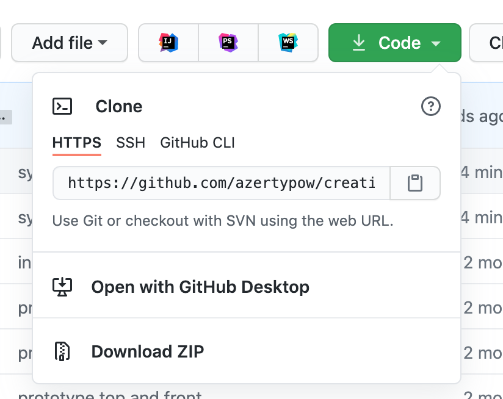

# Maylis webSocket web application

## how to install

1. download or clone projet


   
2. open terminal in project directory
   ```
   cd PATH_OF_DIRECTORY
   ```
   
3. install nodejs dependencies
    ```
    npm install
    ```

## how start app

### dev mode

```
npm run dev
```


### prod mode

```
npm run start
```
